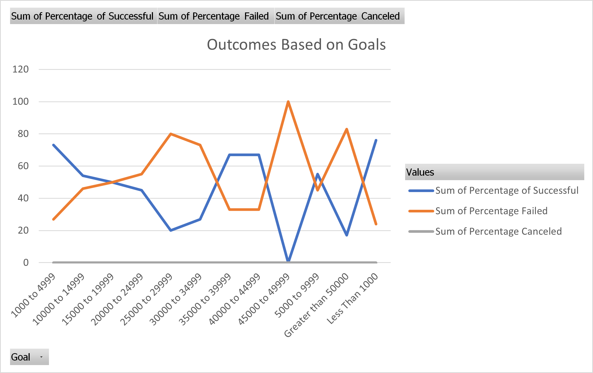

# kickstarter-analysis
Data Bootcamp Module 1 Challenge with Louise's Campaign
----
###

# Kickstarting with Excel

## Overview of Project

The project aimed to see how well campaigns fared with their launch dates and their goals.
These looked at the both the Parent Category Theater to the Subcategory Plays and see how their outcomes compared to the goal amount and the dates.
The analysis includes campaigns from all around the world year round and seasonally.

### Purpose

By understanding how previous compaigns had done in via launch date and meeting their goals, Louise make decision on the goal amount for a future campaign and when it is best to launch it.
Through observing the data, we can better understand how well theater and plays fared in meeting their goal amount and how it relates to their outcomes.
We can find patterns in relations to outcomes and when the campaigns launched.

## Analysis and Challenges

I found it difficult in handling the percentage with the Outcomes based on Goal Amounts.
It was difficult in creating the graph with the pivot table.
It took awhile to understand and observed that the outcome of a campaign is dependent on the set goal amount

### Analysis of Outcomes Based on Launch Date

Looking at the Grand total of outcomes, it can be seen that there tends to be more Theater campaigns mid year.
Cancellations of campaigns tend to occur more in summer with January being the outlier with 7 cancellations.
Summer also tends to have higher failures. At the same time, more campaigns tend to be successful.
Summer tends to have more campaigns, while the rest of the year tends to have fewer campaigns. 

### Analysis of Outcomes Based on Goals

There are no cancellations for Play campaigns
The higher the goal amount, the more likey a Play campaign is to fail
The smaller the goal amount, the more campaigns there tend to be.
The smaller the campaign, the more successful it tends to be.
Play campaigns tend to not have any cancellations.

### Challenges and Difficulties Encountered

I found the outcomes based on goals to be bit challenging when it came to creating the linear graph.
Overall analyzing and trying to see the patterns between the outcomes seem to be challenging.
In addition, the challenging didn't ask for the equal to for campaigns that equal to $50,000 so there may be campaigns that equal to that amount that are not included in the outcomes based on goals.

## Results

- What are two conclusions you can draw about the Outcomes based on Launch Date?
Theater campaigns have the tendency to do well in late spring to earlier summer.
There are less campaigns through the rest of the year.

- What can you conclude about the Outcomes based on Goals?
The higher the goal the more likely that the campaign is to fail.
There are no cancellations with Play campaigns.
Play campaigns tend to very successful, however, we do not know how other Theater type campaigns tend to fair.
Therefore we cannot assume that Play campaigns are the best of all Theater campaigns.

- What are some limitations of this dataset?
Looking at campaign in various countries tend to make it too broad and not specify to area. This doesn't account other variables.
Comparing outcomes based on launch dates for Theater Campaigns and outcomes based on goal amount for Play campaigns can creates different views.
For instance, subcategory Spaces provides a different look and it's parent category is Theater. So when looking into Outcomes based on launch date then you are looking at all the Subcategories of Theater and not just plays.
Whereas, when you are looking at outcomes based on goals, those charts and numbers are based on specifically to Plays.

- What are some other possible tables and/or graphs that we could create?
I think it would benefit Louis is there was a table for outcomes based on pledges to see how much they compared.
In addition to pledges, it would be best to see the average donations based on launch dates to see when people are mostly likely to donate.

